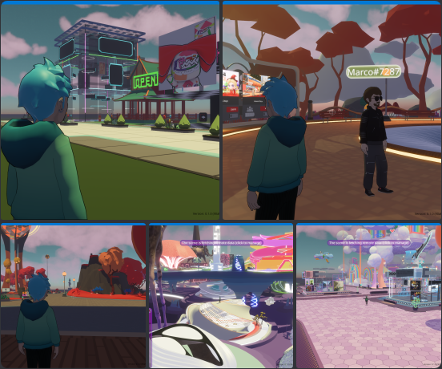

# bevy-explorer

A forward-looking implementation of the Decentraland protocol, written in [rust](https://www.rust-lang.org/) on the [Bevy](https://bevy.org) engine.



One engine, three products:

| Target | What it is | Where it ships |
| --- | --- | --- |
| **Web client** | The engine compiled to WebAssembly (WebGPU), with a React DOM HUD, running in the browser | `@dcl-regenesislabs/bevy-explorer-web` → served at `decentraland.zone/bevy-web` |
| **Desktop client** | Native binary for macOS / Linux / Windows, same React HUD rendered through an offscreen CEF webview | [Releases](https://github.com/decentraland/bevy-explorer/releases/latest) |
| **Headless server** | Authoritative scene server, no rendering — drop-in replacement for `@dcl/hammurabi-server` | `@dcl-regenesislabs/bevy-headless-server` (npm) |

This project's goals are to:
- document current and future protocol standards
- experiment with changes to the protocol
- increase the field of alternative Explorers
- prioritize solid fundamentals, extensibility, and the use of modern open-source frameworks

## Repository layout

| Path | What |
| --- | --- |
| `src/` | binaries: `decentra-bevy` (client), `decentra-bevy-cef` (CEF render-process helper), `headless` (scene server) |
| `crates/` | the engine, split by domain (`scene_runner`, `comms`, `avatar`, `ipfs`, `dcl_deno`, `system_bridge`, …) |
| `react-web/` | the React DOM HUD — one codebase for both web and desktop; see [`react-web/README.md`](react-web/README.md) |
| `react-web/bridge-scene/` | headless SDK7 "super-user" scene that relays engine ↔ React over a `BroadcastChannel` |
| `deploy/web/` | the published web tree: engine boot module + workers + wasm, bridge scene, service worker |
| `deploy/headless/` | npm launcher + per-platform packaging for the headless server |
| `deploy/macos`, `deploy/linux` | desktop packaging (installer, AppImage) |
| `docs/`, `react-web/docs/` | design notes and backlog |

## Prerequisites

Common to every target:

- [rust](https://www.rust-lang.org/tools/install) (stable; the wasm build needs nightly — see below)
- [protoc](https://github.com/protocolbuffers/protobuf/releases) — `brew install protobuf`
- node 20+ (24 in CI) for the React HUD and bridge scene
- optionally [just](https://github.com/casey/just) — `just --list` for the dev entry points used below

Platform libraries (needed by the native and headless builds):

- **linux**: `sudo apt-get install --no-install-recommends libasound2-dev libudev-dev ninja-build clang cmake pkg-config libssl-dev libx11-dev libgl1-mesa-dev libxext-dev` plus ffmpeg dev packages (`libavcodec-dev libavformat-dev libavutil-dev libavfilter-dev libavdevice-dev`)
- **macos**: `brew install ffmpeg@6 pkg-config ninja` and `export PKG_CONFIG_PATH=/opt/homebrew/opt/ffmpeg@6/lib/pkgconfig`
- **windows**: install [clang/LLVM](https://github.com/llvm/llvm-project/releases/) and set `LIBCLANG_PATH`; unzip [ffmpeg 6.0 shared](https://github.com/GyanD/codexffmpeg/releases/download/6.0/ffmpeg-6.0-full_build-shared.7z), set `FFMPEG_DIR` to its root and add `ffmpeg\bin` to `PATH` (ninja and cmake ship with visual studio)

## Web client

The engine is compiled to wasm and boots **in the React page's own document** (no iframe): the canvas sits behind the HUD, and the bridge scene relays between them.

```bash
rustup toolchain install nightly-2026-04-15 --target wasm32-unknown-unknown --component rust-src
cargo install wasm-pack
just wasm     # builds the wasm into deploy/web/engine/pkg, then serves react-web and opens a browser
```

`just wasm` is the whole loop: `wasm-pack build`, re-bundle the sandbox worker (it inlines the wasm glue, so it must be rebuilt with the wasm), `npm install` in `react-web` and `react-web/bridge-scene`, then `npm run dev`.

Useful URLs once the dev server is up:

- `http://localhost:5173/` — real engine + live bridge-scene preview on :8100
- `http://localhost:5173/?mock=1` — full HUD on a fake bridge, **no engine build needed**
- `http://localhost:5173/?bundled=1` — engine loads the exported static bridge scene, i.e. exactly what ships

Requires a WebGPU-capable browser. Deployment topology (versioned CDN base, same-origin rules, COEP service worker) is documented in [`react-web/README.md`](react-web/README.md).

## Desktop client

The desktop build renders the same React HUD through an offscreen CEF webview (`react-hud-cef`, a default feature). Without the HUD bundle the app runs with **no UI at all**.

```bash
just setup-cef                 # once per machine: exports the CEF distribution to ~/.local/share/cef
export CEF_PATH=$HOME/.local/share/cef
# linux only, to run from the target dir:
export LD_LIBRARY_PATH=$CEF_PATH:$LD_LIBRARY_PATH

just native-release            # bundles the HUD if stale, then builds + runs everything
```

`just native-debug` is the same in debug. Both pass extra arguments through:

```bash
just native-release --server https://realm-provider-ea.decentraland.org/main --location 52,-52
```

`--base-domain` retargets every backend host (auth, comms, places, worlds, social, ...) at another deployment's domain:

```bash
just native-release --base-domain interconnected.online --location 0,0
```

On web the same thing is the `?baseDomain=` query param, e.g. `?baseDomain=interconnected.online`. Without the param, the hosting origin decides: a page served under decentraland.zone keys to zone backends, anything else to org.

Doing it by hand instead of via `just`:

```bash
./scripts/gen-ts-bindings.sh                     # TS types for the system API (generated, gitignored)
cd react-web && npm ci && (cd bridge-scene && npm ci) && npm run bundle:native && cd ..
cargo build --release --package dcl_deno_ipc     # scene runtime sidecar
cargo build --release                            # decentra-bevy + decentra-bevy-cef
cargo run --release
```

To build without CEF at all (the engine's own bevy-ui HUD instead of React):

```bash
cargo run --release --no-default-features --features "livekit,ffmpeg,inspect,social"
```

## Headless server

An authoritative scene server with no renderer — the SDK spawns it for scenes with `authoritativeMultiplayer` enabled.

```bash
npx @dcl-regenesislabs/bevy-headless-server --realm http://localhost:8000
```

From source (the binary is feature-gated out of default builds, and execs the sidecar from its own directory, so both land in `target/release`):

```bash
cargo build --release -p dcl_deno_ipc
cargo build --release --bin headless --no-default-features --features headless,livekit
./target/release/headless --realm <url> --location 0,0 --server-mode
```

`--orchestrated` runs it as a multi-scene worker driven over stdin/stdout instead. See [`deploy/headless/launcher/README.md`](deploy/headless/launcher/README.md) for the CLI contract and [`docs/headless-sdk-preview.md`](docs/headless-sdk-preview.md) for how it replaces hammurabi in the SDK preview.

## Arguments

`cargo run --release --bin decentra-bevy -- [options]`

**World**
- `--server <url>` — content server / realm. Defaults to `https://realm-provider-ea.decentraland.org/main`.
- `--content-server <url>` — override the content server only.
- `--location 52,-52` — parcel to spawn at.
- `--distance <n>` — scene load distance in meters (default 100). Also `/scene_distance`.
- `--unload <n>` — extra distance before scenes are unloaded.
- `--threads <n>` — max simultaneous scene-javascript threads (default 4). Also `/scene_threads`.
- `--preview` — preview mode (local gatekeeper, no failed-asset backoff).

**Rendering**
- `--vsync (true|false)` — defaults to off.
- `--fps <n>` — target fps (default 60; overridden by the refresh rate when vsync is on). Also `/fps`.
- `--gpu_bytes_per_frame <n>` — cap per-frame gpu uploads.
- `--no_gltf`, `--no_avatar`, `--no_fog` — disable gltf loading / avatar rendering / distance fog.
- `--bake (f|h|q|o)` and `--impost <d1,d2,…>` — imposter baking speed and distances.

**UI**
- `--ui <scene|none>` — use a specific system scene, or `none` for no system scene. Any explicit `--ui` opts **out** of the React HUD; without it, HUD builds load the bundled bridge scene.
- `--params "key1=value1&key2=value2"` — arbitrary parameters for the system scene, readable via `BevyApi.getParams()`. On web, URL query parameters are forwarded automatically (with decoding).
- `--builtin-login`, `--builtin-chat`, `--builtin-emotes`, `--builtin-nametags`, `--builtin-perms`, `--builtin-tooltips`, `--builtin-loading-scene-ui` — force individual engine-drawn UI pieces back on.

**Debug**
- `--inspect <scene_hash>` — pause that scene's js runtime until a debugger (e.g. `chrome://inspect`) attaches. Needs `--features inspect`.
- `--scene_log_to_console`, `--sysinfo`, `--log_fps <n>`.
- `--test_scenes "52,-52;52,-54"` — run the scene test harness over those parcels and exit.

## Testing

```bash
cargo test --all                      # engine
npm test --prefix react-web           # HUD, deterministic (vitest, no engine)
npm run test:e2e --prefix react-web   # HUD against a real engine (playwright, needs a GPU)
```

`react-web/review.md` is the pre-merge checklist for anything under `react-web/`.

## CI and release channels

[`.github/workflows/ci.yml`](.github/workflows/ci.yml) is the most accurate source of build information — it covers fmt, clippy, the test matrix, a headless smoke test, and the web build/deploy.

- **Web** — every push to `main` publishes `@dcl-regenesislabs/bevy-explorer-web` (npm + CDN) from `deploy/web`.
- **Headless** — `publish-headless.yml` publishes a snapshot on `next` per main push; releasing to SDK previews means dispatching it with `dist_tag=latest`.
- **Desktop** — `package.yml`, dispatched manually, cuts a GitHub prerelease (linux + windows; the macOS leg is disabled pending notarization secrets).

Built by DCL Regenesis Labs — dclregenesislabs.xyz

Powered by the Decentraland DAO

